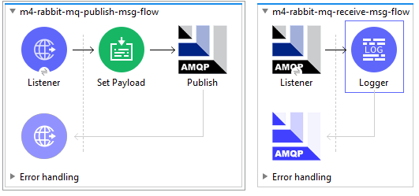

# Mulesoft 4.3 RabbitMQ using AMQP protocol 

```
Mulesoft Version 4.3.0
Created on 11-May-2020
Last updated on 11-May-2020
Last updated by SenthilKumar
```

## RabbitMQ simple message flow
http://localhost:8081/publish?firstName=Sobin&lastName=John
